# 🛡️ Phishing Detection System

A hybrid phishing detection system combining **machine learning** and **rule-based analysis** to identify malicious URLs and spam messages. Built with Flask and trained on 150+ MB of real-world phishing data.

---

## 🎯 Overview

This project detects phishing attempts in two categories:
- **URLs**: Identifies malicious/phishing websites
- **Messages**: Detects spam and phishing text messages

The system uses a **hybrid approach**:
1. **Machine Learning Models** - Trained on large datasets (42MB URLs + 107MB messages)
2. **Rule-Based Detection** - Pattern matching and heuristic analysis
3. **Combined Scoring** - Weighted integration of both methods

---

## ✨ Features

- 🎯 **Dual Detection**: URLs and text messages
- 🤖 **ML-Powered**: Random Forest classifiers with 85-95%+ accuracy
- 📊 **Risk Scoring**: Numerical risk assessment (0-100+)
- 🔍 **Detailed Analysis**: Shows specific risk indicators
- 🌐 **Web Interface**: User-friendly Flask web app
- 📈 **Real-time Predictions**: Instant classification
- 🔄 **Retrainable**: Easy model updates with new data

---

## 🏗️ System Architecture

```mermaid
graph TB
    A[User Input] --> B{Input Type Detection}
    B -->|URL| C[URL Analysis Pipeline]
    B -->|MESSAGE| D[Message Analysis Pipeline]
    
    C --> E[Pattern Analysis]
    C --> F[ML URL Classifier]
    
    D --> G[Content Analysis]
    D --> H[ML Message Classifier]
    
    E --> I[Rule-Based Scoring]
    F --> I
    G --> I
    H --> I
    
    I --> J[Combined Risk Score]
    J --> K{Risk Level}
    
    K -->|0-30| L[LOW RISK ✅]
    K -->|31-70| M[MEDIUM RISK ⚠️]
    K -->|71+| N[HIGH RISK 🚨]
    
    L --> O[Display Results]
    M --> O
    N --> O
```



---

## 🔄 Detection Pipeline

### URL Detection Flow


### Message Detection Flow


---

## 📂 Project Structure

```
mini-project/
├── 📊 data/                    # Training datasets (gitignored)
│   ├── url3.csv               # URL phishing data (42 MB)
│   └── msg.csv                # Message spam data (107 MB)
│
├── 🤖 models/                  # Trained ML models (gitignored)
│   ├── url_classifier.joblib
│   ├── url_vectorizer.joblib
│   ├── msg_classifier.joblib
│   └── msg_vectorizer.joblib
│
├── 🌐 templates/               # HTML templates
│   └── index.html
│
├── 🎨 static/                  # CSS/JS assets
│   ├── css/
│   └── js/
│
├── 🐍 Core Python Files
│   ├── app.py                 # Flask application
│   ├── input_detector.py      # Input type detection
│   ├── rules.py               # Rule-based + ML scoring
│   ├── score_engine.py        # Final decision logic
│   ├── advisor.py             # Advisory messages
│   ├── ml_predictor.py        # ML model loader
│   └── train_model.py         # Training script
│
├── 📦 Configuration
│   ├── requirements.txt       # Python dependencies
│   ├── Dockerfile             # Docker configuration
│   └── .gitignore
│
└── 📖 Documentation
    ├── README.md              # This file
    └── TRAIN_MODELS.md        # Training guide
```

---

## 🚀 Quick Start

### Prerequisites

- Python 3.8+
- pip (Python package manager)

### Installation

1. **Clone the repository**
   ```bash
   git clone <repository-url>
   cd mini-project
   ```

2. **Install dependencies**
   ```bash
   pip install -r requirements.txt
   ```

3. **Add your datasets** (optional, for ML training)
   - Place `url3.csv` in `data/` folder
   - Place `msg.csv` in `data/` folder

4. **Train ML models** (optional but recommended)
   ```bash
   python train_model.py
   ```
   *Training takes 5-10 minutes*

5. **Run the application**
   ```bash
   python app.py
   ```

6. **Open in browser**
   ```
   http://localhost:7860
   ```

---

## 💻 Usage

### Web Interface

1. Navigate to `http://localhost:7860`
2. Enter a URL or message to analyze
3. Click "Analyze"
4. View results:
   - **Risk Level**: LOW / MEDIUM / HIGH
   - **Risk Score**: Numerical assessment
   - **Detection Reasons**: Specific indicators found
   - **Advisory**: Recommended actions

### Example Inputs

**Phishing URL:**
```
http://paypal-verify-account.xyz/login
```

**Legitimate URL:**
```
https://google.com
```

**Spam Message:**
```
Congratulations! You won $1000! Click here to claim now!
```

**Legitimate Message:**
```
Hey, let's meet for coffee tomorrow at 3pm
```

---

## 📊 How It Works

### 1. Input Detection

```python
# Automatically determines if input is URL or MESSAGE
detection_result = detect_input_type(user_input)
input_type = detection_result['type']  # 'URL' or 'MESSAGE'
```

### 2. Feature Extraction

**URLs**: Character-level n-grams (2-4 characters)
```
Example: "paypal.com" → ['pa', 'ay', 'yp', 'pal', 'pay', ...]
```

**Messages**: Word-level TF-IDF (1-2 word n-grams)
```
Example: "Click here now" → ['click', 'here', 'now', 'click here', 'here now']
```

### 3. ML Classification

- **Algorithm**: Random Forest (100 decision trees)
- **Training Data**: 
  - URLs: ~42 MB, thousands of samples
  - Messages: ~107 MB, thousands of samples
- **Output**: Prediction + confidence score (0-100)

### 4. Rule-Based Analysis

Checks for:
- 🔴 Suspicious keywords (urgent, verify, winner, etc.)
- 🔴 Credential requests (password, login, ssn)
- 🔴 Obfuscation techniques
- 🔴 Suspicious domains/TLDs
- 🔴 URL shorteners
- 🔴 Personal information requests

### 5. Combined Scoring

```
Final Score = ML Score + Rule-Based Score

Classification:
- 0-30:   LOW RISK ✅
- 31-70:  MEDIUM RISK ⚠️
- 71+:    HIGH RISK 🚨
```

---

## 🎓 Machine Learning Details

### Models

| Component | Algorithm | Features | Accuracy |
|-----------|-----------|----------|----------|
| URL Classifier | Random Forest | Character n-grams (5000 features) | 85-95% |
| Message Classifier | Random Forest | Word TF-IDF (5000 features) | 90-98% |

### Training Process


### Dataset Format

**url3.csv**:
```csv
url,label
http://phishing-site.com,1
https://google.com,0
```

**msg.csv**:
```csv
label,text
1,"Congratulations! You won..."
0,"Hey, how are you?"
```

*Labels: 0 = Legitimate, 1 = Phishing/Spam*

---

## 🐳 Docker Deployment

```bash
# Build image
docker build -t phishing-detector .

# Run container
docker run -p 7860:7860 phishing-detector
```

Access at `http://localhost:7860`

---

## 📈 Performance

### Accuracy Metrics

- **URL Detection**: 85-95% accuracy
- **Message Detection**: 90-98% accuracy
- **Response Time**: < 100ms per prediction
- **Model Size**: ~50 MB total

### Risk Detection Examples

| Input | Type | Risk Score | Classification |
|-------|------|------------|----------------|
| `https://google.com` | URL | 5 | LOW ✅ |
| `http://bit.ly/abc123` | URL | 45 | MEDIUM ⚠️ |
| `http://paypal-verify.xyz` | URL | 95 | HIGH 🚨 |
| `"Hello friend"` | MSG | 2 | LOW ✅ |
| `"Click here to win!"` | MSG | 88 | HIGH 🚨 |

---

## 🛠️ Configuration

### Change Port

Edit `app.py`:
```python
port = int(os.environ.get("PORT", 7860))  # Change 7860
```

### Adjust Risk Thresholds

Edit `score_engine.py`:
```python
if score < 30:    # Adjust thresholds
    return "LOW"
elif score < 70:
    return "MEDIUM"
else:
    return "HIGH"
```

---

## 🔧 Troubleshooting

### Models Not Loading

**Problem**: `⚠ Models directory not found`

**Solution**:
```bash
python train_model.py
```

### Import Errors

**Problem**: `ModuleNotFoundError: No module named 'sklearn'`

**Solution**:
```bash
pip install -r requirements.txt
```

### Port Already in Use

**Problem**: `Address already in use`

**Solution**:
- Stop other Flask apps on port 7860
- Or change port in `app.py`

---

## 📝 Contributing

To add new phishing patterns:

1. Update datasets (`data/url3.csv` or `data/msg.csv`)
2. Retrain models: `python train_model.py`
3. Restart application: `python app.py`

---

## 🔒 Security Note

This tool is for **educational and research purposes**. While it achieves high accuracy, no detection system is perfect. Always:

- ✅ Verify suspicious links manually
- ✅ Use official contact methods for sensitive accounts
- ✅ Never enter credentials on suspicious sites
- ✅ Keep this tool updated with latest phishing patterns

---

## 📚 Technology Stack

- **Backend**: Flask (Python web framework)
- **ML**: scikit-learn (Random Forest, TF-IDF)
- **Data**: pandas, numpy
- **Serialization**: joblib
- **Frontend**: HTML, CSS, JavaScript
- **Deployment**: Docker, WSGI (gunicorn)

---

## 📄 License

This project is for educational purposes.

---

## 🙏 Acknowledgments

- Phishing datasets from public sources
- scikit-learn for ML algorithms
- Flask framework for web interface

---

## 📞 Support

For issues or questions:
- Create an issue in the repository
- Review `TRAIN_MODELS.md` for training help
- Check logs for error messages

---

**Made with 🛡️ to fight phishing**
